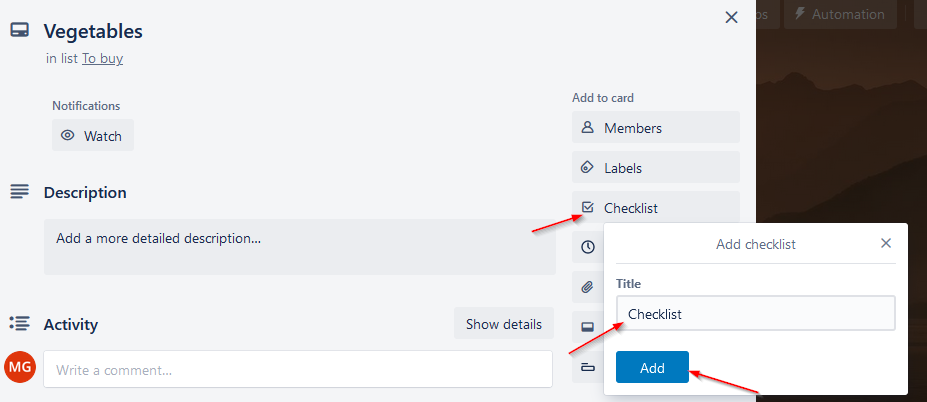
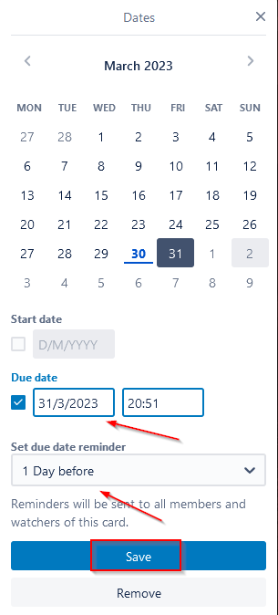

# **Make shopping easier with Trello**

While shopping may seem like an easy task, it can be frustrating and time-consuming. Use **Trello** to create a perfect shopping list and shop for groceries like a pro. 

Here’s a tutorial on how to make a shopping list with three categories: **to buy**, **bought** and **not bought**. Hop right it and check it out!

### **Getting started**

To start using Trello go [here](https://trello.com/login) and set up an account. All done? Ok, now simply follow the steps below.

## **Create a new board**

There are _three_ basic elements you will use in this tutorial: **boards**, **lists** and **cards**. Feeling lost? Don’t worry, Trello is very easy to navigate. 

A _board_ is a place where you can track all the lists you’ve created. Here you can make changes to the lists or share them with others. 

**To create a board**:

1. Log into your [Trello account](www.trello.com/login). Once in, you will be redirected to your workspace platform - it's where you will create your board. You can use the templates available or create a new one from scratch. For the purpose of this tutorial, you will create your own board.

2. Click the **Create new board** button in the middle of the screen.   

> Quick note: you can also click the **Create** button at the top of the page.

You should now see a box pop up. There are three basic things you can do here:

1. Set your board’s background. To do that choose one of the photos or solid colors displayed in the box. Nothing you like? Click the three dots for more background options.

2. Name your list. Type **Shopping list** in the **Board title** field.

3. Change your board’s visibility. You can make it private or public. 
  _**Since it will be your private to-do board, we suggest you switch its visibility to private.**_ To do that: 
    open the drop-down menu and click **Private**. 

Once you’ve completed all the steps, click the **Create** button. It’s as simple as that!

## **Invite members to a board**

> A great way to lift some weight off your shoulders is to share it with others. 

Yes, it definitely applies to shopping! 

**To invite others to your board:**

Once finished with the board creation process, you will be redirected straight into your Shopping list board. Follow the below steps to invite new members to your board. There are two ways to do that.

**Using an email or a name**  

1. Click the **Share** button in the top right corner of the screen.

> Or click **Members** or the **+** symbol on the left-side menu.

2. Search for a person you want to invite by typing their name or email address.

3. Click **Share**.

> What's great about Trello is that you can invite people who have never heard of Trello before! Just type in their email and send them an invite. 

**Using a link**

1. Click the **Share** button in the top right corner of the screen.

2. Select **Create link** under the **Share this board with a link** phrase.

3.	Paste the link in an email message and send it to a person you want to invite. 

### **Add a list to your board**

Remember that there were _three_ basic elements you were going to use in this tutorial? You've already learned what a board is. Now, let's create a **list**.

Imagine you're writing a shopping list in your notepad. It's usually a long, unordered list of different items you need to buy. A list in Trello looks very much alike! It contains a number of vertically-arranged cards representing different products. 

See how to create one in only _three_ steps.

1. Click the **Add a list** button at the top of the screen. 

2. Title your list. For the purpose of this tutorial, title the first list **To buy**.

3. Click **Add list**. 

Now create two more lists titled **Bought** and **Not bought** following the same steps.

### **Add a card to your list**

All you have to do now is add cards to your lists. The cards are like bullet points representing different to-do tasks or to-buy products.

You can add cards with each one representing a single food item. But here's our tip for more time efficient shopping.

> Group single food items into categories and buy all vegetables or fruit at once to avoid going back and forth across opposite ends of the store.

**To create cards:**

1. Click the **Add a card** button under the name of your list. 

_In this tutorial create one for your **To-buy** list._

> Quick note: You can also click the three dots in the window’s top right corner and then the **Add card…** button. 

2. Name the card and click **Add card**. 

_Name the first card **Vegetables** and then create the second one and name it **Fruit**._

### **Add a checklist to your cards**

Your shopping list looks great. But here's yet another great function you can use to make it even better. To keep track of every single item you need to buy use a _checklist_.

**To add a checklist to your card:**

1. Open the card you want to add a checklist to and click the **Checklist** button under the **Add to card** section. 

2. Title your checklist and click **Add**. 

3. To add an item to the checklist type it in the empty field and confirm by clicking **Add**. Add as many items as you like.

_Include different vegetables in the checklist added to your **Vegetables** card, such as cucumber, lettuce, tomato, etc. Do the same with the **Fruit** card._

> You can _check_ each item once bought so it's ~~crossed out~~ from your checklist!

You're almost there!  

But! There are a few more things you can do with your cards:

* Assign the card to the previously added board member,
* Set a due date for the card (and a date reminder),
* Move the card from **To buy** to **Bought**.

### **Assign a card to a board member**

1. Go to **Members** under the **Add to card** section. 

2. Click the Board member you want to assign your card to.

Once done, the member’s initials will be displayed on your card.

### **Set a due date and a date reminder**

This function will help you better organize your time and you can set a date reminder for 2 days or just 5 minutes before!

1. Click **Dates** under the **Add to card** section.

2. Set a due date and a date reminder and click **Save**.

### **Move a card to another list**

The simplest way to do that is to click and drag a card between lists. Move the **Vegetables** card from **To buy** to **Bought**.

> For more options:
> * hover over a card,
> * click on the **pencil** symbol,
> * click **move**.   
>You can now move your card to a suggested location or select its destination yourself. You can even move it to another board!  

**Congratulations!** You've completed all the steps to create a perfect shopping list.

There's still much more to accomplish with [Trello](www.trello.com).

You can dive into [Trello resources](https://support.atlassian.com/trello/resources/) to learn more about its functionalities or learn some useful tips by visiting [Trello blog](https://blog.trello.com/).

 

